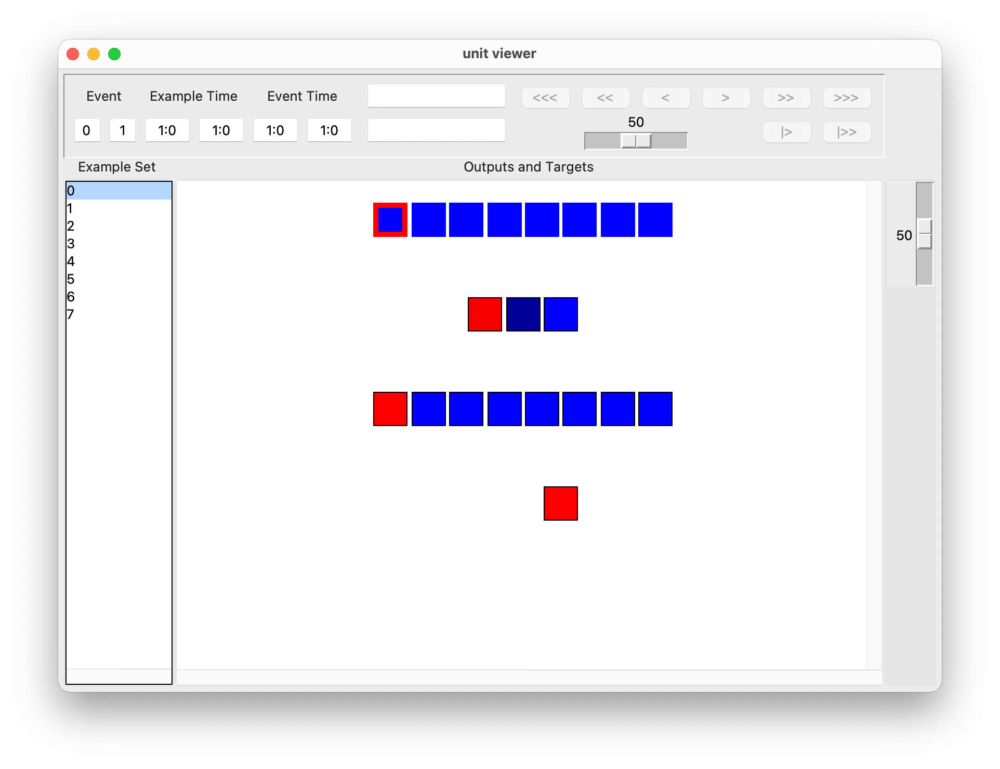
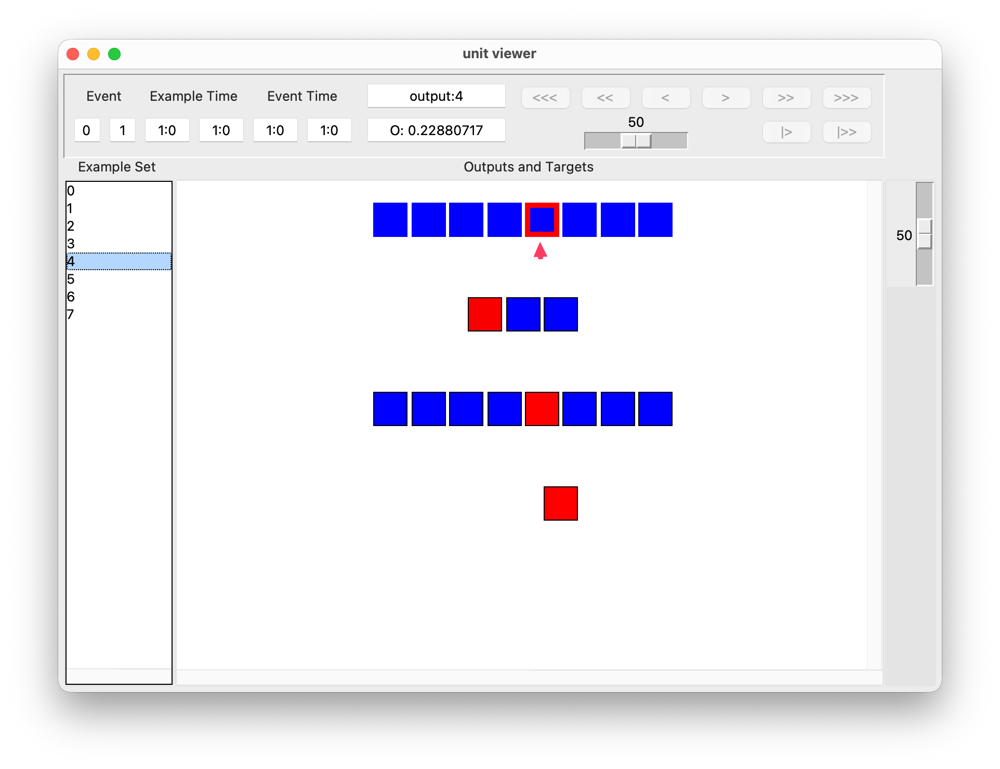
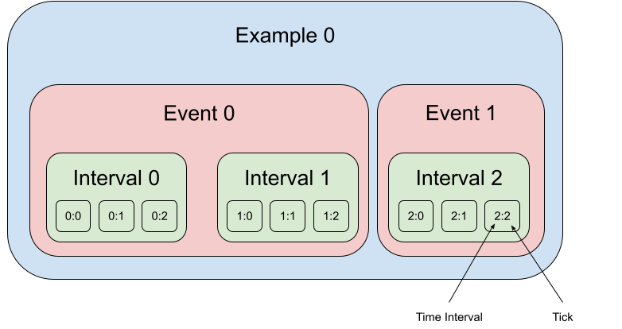

Unit Viewer
================
The Unit Viewer provides a graphical representation of the units in the network, including information about unit values and event time.

The Unit Viewer can be invoked from the GUI's Main Viewer once a network is loaded. As an example, here we load the network python script ``encoder_example_one.py`` from the ``examples/example_networks/encoder_examples/`` folder of PyLens. For this network, the Unit Viewer looks like this:

The Unit Viewer consists of:

- A **main panel** displaying a graphical representation of the network units. Each unit in the network's architecture correspond to a square cell. The units are sorted in reverse order in which layers were specified, layer by layer.
- A **sidebar** (on the left) that lists the training (or testing) examples loaded in the network.
- An **information bar** (in the upper half) that provides information about events, unit and link values, and the color pallette.
- A **drop-down menu bar** (at the very top of the window (on Windows) or screen (on Mac)) that allows you to control miscellaneous settings.

Inspecting Unit Values
------------------------
Click on a specific ``Example Set`` on the left tab to see the values of each unit for that example. You can see information about each unit by hovering over its cell. More technically, clicking on an example will call ``lb_onselect``, running the network on that example.

Unit information is displayed in the two boxes in the centre of the information bar. The upper box displays the group name, index, and name (if any) of the active unit. The lower box displays the unit's value. If the value begins with "O:", this indicates the unit's output, and if the value begins with "T:", this indicates the target.

Usually, the active unit is the one that your mouse is hovering over. However, you can lock the active unit by left-clicking it. The locked unit will have a pink border. After locking the active unit, you can click on different examples or re-train the network and continue to see the value of that unit in the information bar. The locked unit can be released by left-clicking it again, or by clicking on the whitespace.

To **change the type of value displayed** (e.g., to external inputs, these are the inputs to input units set by training examples), click on the ``Value`` tab at the top of the window or (screen on Mac) and select the desired type of value to display. 

.. figure:: ../images/external-input.png
   :alt: Selecting and displaying external-input values in the unit viewer.
   :width: 600
   :align: center

Inspecting Unit Connectivity
---------------------------------
Right-clicking on a unit will display the weight of the connections coming into and out of the unit by hovering over the corresponding connected unit.

.. figure:: ../images/weight-output.png
   :alt: The unit with the yellow outline is connected to the output 4 unit with a weight of 0.36. 
   :width: 600
   :align: center

Changing Example Sets, Procedures, and Color Palettes
-------------------------------------------------------
Click the ``Example Set`` tab at the top to change the example set between training and testing sets.

For some networks, the inference procedure is different during training and during testing (e.g., for Boltzmann machines). To change the Procedure, click the ``Procedure`` tab at the top.

Use the ``Palette`` tab to change the color palette of the unit viewer.

.. # note: the slider doesn't do anything for me; also, the description needs to be updated because there is a horizontal, not a vertical slider

In addition, the slider at the far right of the information bar can be used to control the color temperature of the cells. The cell values on different halves of the cell value range generally take two different colors (e.g., red vs. blue). When the slider is at the top, the temperature is intense, and any cell value is saturated with its corresponding extreme color (e.g. pure blue vs pure red). When the slider is at the bottom, the color sigmoid is flat, cell values close to upper/lower bound of the value range still tend to their extreme colors and cell values close to midpoint tend to the midpoint color defined by the palette (e.g. black). Each of the color palettes uses 101 different colors.

.. _time-events-and-ticks:

Time: Events and Ticks
-----------------------
Basically, an example consists of one or more events. An event is a single pair of input and target to the network. Each event lasts for one or more time intervals. Time intervals are meant to represent abstract units of time in the network's environment. You might think of a time interval as a second or a tenth of a second of real time.

The actual simulation proceeds in discrete steps called ticks. An interval may contain one or more ticks. In standard feedforward and simple recurrent networks, there is typically one tick per time interval. In continuous networks, there can be multiple ticks per time interval, allowing the network's continuous-time dynamics to be simulated at a finer resolution.

This upper panel is mainly used for moving through examples that involve more than one tick. This is mainly relevant for recurrent and continuous networks. Normally, standard feedforward networks use examples that only have one tick. That is, there is a single presentation of inputs and forward pass through the network. In this case, most of this panel can be ignored.

The ``Event`` entries show the index of the example event that was taking place during the currently displayed tick and the total number of events in the current example. Event numbers start counting at 0 and end with one less than the total number of events. In continuous networks, the first tick is used to set the initial unit outputs and thus has no event associated with it. In this case, the event field will be blank.

``Example Time`` shows the time of the current tick and the total time spent on the current example. The time is of the form ``interval:tick`` where ``interval`` is the interval of "real" time and ``tick`` is the discrete simulation step within that an interval. For instance, if the example lasted for two intervals and there are three ticks per interval (a ``dt`` of 0.333), the ticks would be numbered 0:1, 0:2, 1:0, 1:1, 1:2, 2:0.

``Event Time`` shows the timing of the current tick relative to the start of the current event. The format is the same as for example time.

To navigate between ticks, use the buttons on the right:
 
- ``<<<``: Jumps to the first tick of the first event in the current example.

- ``>>>``: Jumps to the last tick of the last event in the current example.

- ``<<``: Jumps to the beginning of the current event. If the current tick is already at the beginning of the current event, it jumps to the beginning of the previous event. (The button is disabled if currently at the first tick of the first event.)

- ``>>``: Jumps to the end of the current event. If the current tick is already at the end of the current event, it jumps to the end of the next event. (The button is disabled if currently at the last tick of the last event.)

- ``<``: Steps one tick backward and can step across event boundaries.

- ``>``: Steps one tick forward and can step across event boundaries.

- ``|>``: Starts from the current tick, automatically steps until the end of the current event or until the end of the next event if already at the end of an event. The rate of stepping is controlled by the slider to the left.

- ``|>>``: Automatically steps until the end of the example. The rate of stepping is controlled by the slider to the left.

Updating and Refreshing Units
---------------------------------
Click on the ``Viewer`` tab and select ``Update`` to force an immediate update, which updates the colors in the unit cells. 

In contrast, clicking on the ``Viewer`` tab and selecting ``Refresh`` will rebuild the network illustration by calling ``draw_tick``.

Layout Customization
-------------------------
The network layout is defined using either the draw_group command or the draw_tick command. The create_node function is responsible for plotting each individual unit on the canvas. By default, the number units per column will automatically be decided by the current width of the unit viewer.

The Unit Viewer current does not support any custom designs or layouts but the number units per column can be customized by the user. If you would like to design your own layout, you should read the manual pages for the other commands.
