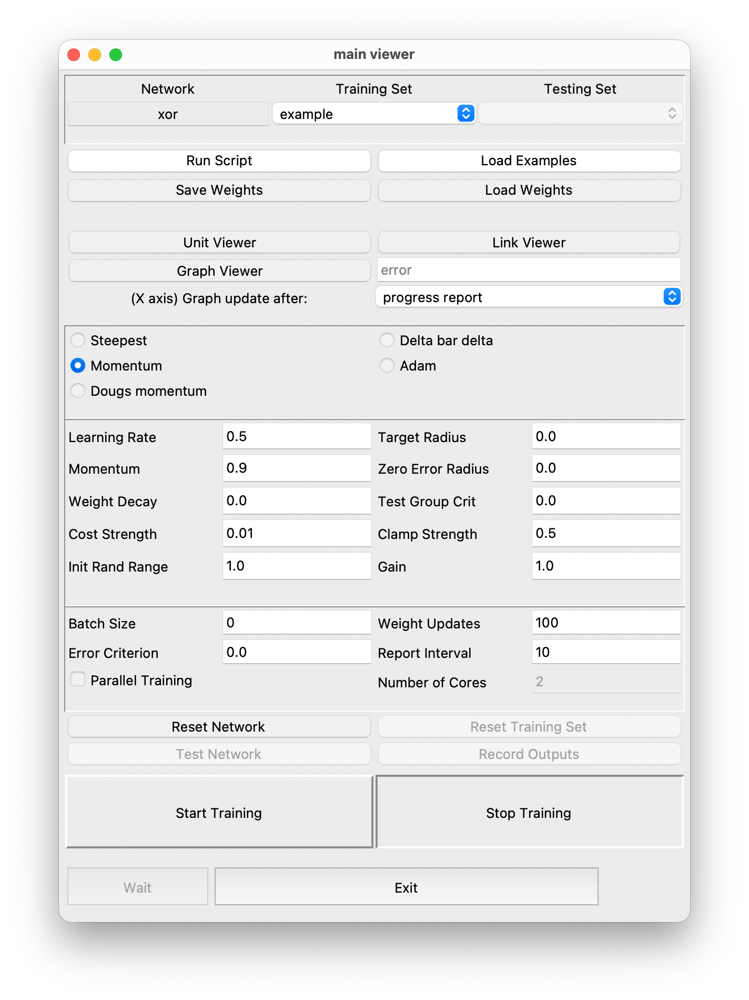

.. _pylens_xor_tutorial:

Beginner's Tutorial
==========================================

In this tutorial, you will learn how to use **PyLens** to build a simple neural network that addresses the classic **XOR problem** — a common example in neural networks that demonstrates a function which is not linearly separable. (See the `XOR Wikipedia entry <https://en.wikipedia.org/wiki/Exclusive_or>`_ for more details.) 

Specifically, you'll learn how to set up and train the XOR network **using the PyLens GUI**, which allows you to perform several key tasks, such as visualizing network layers, monitoring real-time plots, and interactively exploring training progress.

Preparation
--------------

1. **Install PyLens**:  
   If you have not installed PyLens yet, please follow the instructions in 
   :doc:`Installing PyLens <installation>`.

2. **Navigate to Your PyLens Folder**:
   By default, PyLens may be installed in a directory of your choice.  
   In this tutorial, when we see paths like ``./examples/lens_example_input/xor_dense.ex``, the leading 
   ``.`` indicates the **current PyLens directory** (or the directory where you cloned the PyLens repository).
   If you are unsure where that is, check the directory where you ran ``git clone ...`` or wherever you installed 
   PyLens according to the instructions.

   .. code-block:: bash

      cd .../PyLens [replace ... with actual folder path]

3. **Ensure Required Data and Weights**:
   Verify that the following files exist in your PyLens installation (or cloned) folder:

   - ``xor_dense.ex`` located in:  
     ``./examples/lens_example_input/xor_dense.ex``  

   - ``xor_example_one_weights.wt`` located in:  
     ``./examples/example_networks/xor_examples/xor_example_one_weights.wt``  

   These files provide the XOR training examples and a reference set of initial weights.  
   If you do **not** have these files, try reinstalling PyLens or updating your local PyLens repository.

Launching the GUI
-------------------------------------

The focus of this tutorial is on using the GUI to train and visualize the XOR network. Below is the typical process:

1. Open the **Anaconda Prompt** (Windows) or **Terminal** (macOS/Linux).

2. **Activate Your Python/Virtual Environment** (if using one). For details, see 
   :doc:`Step 3 of the Installation Guide <installation>`.

   .. code-block:: bash

      conda activate pylens_env

3. **Run the tutorial** by enabling the GUI in the script and executing:

   .. code-block:: bash

      python examples/example_networks/xor_examples/xor_example_one.py

Interacting with the GUI
-------------------------------------

Once the GUI is open, you will see the PyLens GUI structured as follows, providing various tools for visualizing network components, tuning parameters, and monitoring training progress.

By running our script, we have already built a network and loaded our example set. So let us explore the structure of this network, starting with its units.

1. **Exploring the Unit Viewer**

   Click on **Unit Viewer**. A new window will open, which allows you to inspect individual neurons, activation values, and responses. By clicking on each unit, you can see whether it belongs to the **input layer**, **hidden layer**, or **output layer**, helping you understand how information flows through the network.

   .. image:: images/unit_viewer.png
	   :alt: Unit Viewer Example

   For example, in the XOR network, you can observe:

   - Two input units corresponding to the two binary inputs of the XOR function.

   - One hidden layer unit, which are crucial for capturing the non-linearity required to solve XOR.

   - One output unit, which determines the final network prediction.
    
   - One bias unit, which specifies a constant that is used to adjust the output.
            
   Next, let us take a look at the network links.

2. **Exploring the Link Viewer**

   In the GUI window, click on the **Link Viewer**. A new window will open that visualizes weight connections between neurons.
    
   .. image:: images/link_viewer.png
       :alt: Link Viewer Example

   Here, you can observe that:

   - The displayed values represent the weight strength between different network layers.

   - Red and blue colors indicate positive and negative weights, respectively, helping you understand how signals propagate through the network.

   In the next step, we will train the network and create a graph to  inspect its performance.

3. **Training the Network and Creating Graphs**

   To visualize how our network learns the XOR problem, we want to train the network and plot its performance. In the box next to ``New Graph``, type the variable for the graph you want to create. Here, we want to visualize the network "error" (as in the image below). Then, click ``New Graph`` to create an empty graph.

   .. image:: images/graph_viewer.png
       :alt: Graph Viewer Example

   Now, we can train our network. While keeping the error graph open, click on ``Start Training`` in the main GUI. Repeat this process several times.

   .. image:: images/training-control.png
       :alt: Training Control Panel

   As you can see, the graph dynamically visualizes changes in error as we keep updating the network weights. In other words, the network is gradually learning the non-linear separation between training examples required by the XOR problem. You can reset the network to the intial state with random weights by clicking on ``Reset Network``.
    
   Additional graphs can be created to visualize other metrics during training, based on the variable you input.

   As a final step, we will explore how changing the network parameters influences training.

4. **Tuning Parameters**

   A range of essential training parameters can be modified in the GUI, including:

      - Learning rate

      - Momentum

      - Weight decay

      - Batch size

      - Optimizer selection (Steepest Descent, Momentum, Adam, etc.)

   Change the values in the respective fields or select a different optimizer to observe how different settings impact training. For example, you may be able to see how a lower learning rate slows down learning, or how a larger batch size leads to less frequent weight updates.

   .. image:: images/parameter_tuning.png
       :alt: Parameter Tuning Example
    
   For more details on the GUI’s features and components, please consult the section :doc:`Graphical User Interface (GUI) <GUI/index>`.

Where to Go From Here?
-------------------------

We hope you enjoyed exploring PyLens and understanding some core concepts of neural network training through the classic XOR example. For next steps, you might consider the following:
 
   - **Explore the GUI**: Read the :doc:`GUI documentation<GUI/index>` for more detailed information on the GUI's features and how to interact with them.

   - **Experiment**: Try different training parameters, network architectures, and activation functions to see how they affect the network's performance. 

Bonus: Code Explanation
------------------------------------------------

If you want a deeper look at how the XOR network is set up in ``examples/example_networks/xor_examples/xor_example_one.py``, below are the major code chunks with brief explanations.

1. **Simulator/Network Creation**: 
   We start by instantiating a :code:`Simulator` named ``sim_xor`` and then creating a network called ``xor_net_one``:

   .. code-block:: python

      from PyLens.simulator import Simulator

      # Create simulator
      sim = Simulator(name="sim_xor")

      # Create network
      xor_net_one = sim.create_net(name="xor")

2. **Network Architecture**: 
   We add three groups (layers)—an input layer, hidden layer, and output layer—and connect them:

   .. code-block:: python

      # Add the input layer (2 units)
      xor_net_one.add_group(
          2,
          name="input",
          group_type="input",
          input_transforms=[],
          output_transforms=[]
      )

      # Add the hidden layer (2 units, sigmoid activation)
      xor_net_one.add_group(
          2,
          name="hidden",
          group_type="hidden",
          input_transforms=["dot"],
          output_transforms=["sigmoid"]
      )

      # Add the output layer (1 unit, sigmoid + cross_entropy error)
      xor_net_one.add_group(
          1,
          name="output",
          group_type="output",
          input_transforms=["dot"],
          output_transforms=["sigmoid"],
          error_function="cross_entropy"
      )

      # Connect layers (full projection)
      xor_net_one.connect_groups(
          outgoing_group="input",
          incoming_group="hidden",
          link_type="uniform",
          proj_type="full"
      )
      xor_net_one.connect_groups(
          outgoing_group="hidden",
          incoming_group="output",
          link_type="uniform",
          proj_type="full"
      )

   The **input** layer has 2 units, the **hidden** layer has 2 units (with sigmoid activation),
   and the **output** layer has 1 unit (with sigmoid + cross_entropy error).  
   We use full, uniform connections from input → hidden and hidden → output.

3. **Loading Data & Weights**  

   .. code-block:: python

      xor_net_one.load_example_set("./examples/lens_example_input/xor_dense.ex")
      xor_net_one.load_clen_weight("./examples/example_networks/xor_examples/xor_example_one_weights.wt")

   This loads the XOR truth table examples and an initial weight file (seeded for consistency with a *clens* reference).

4. **Training Loop**  

   .. code-block:: python

      # Set hyperparameters
      batch_size = 0
      num_updates = 2
      report_interval = 1
      learning_rate = 0.5
      update_method = "steepest"

      xor_net_one.set_update_method(learning_rate, update_method)
      xor_net_one.train(num_updates, batch_size, report_interval)

   We train for 100 updates using gradient descent with momentum (:code:`learning_rate=0.5`). This short run demonstrates the 
   basic correctness of the network (you can extend this for more iterations if desired).
