GUI: Tutorial
================
The PYLens GUI allows users to load and train networks while also providing a graphical interface to explore how the network weights, units and performance evolve over training updates. To start an empty PYLens GUI, install PYLens and run the following code from the root folder.

.. code-block:: console

    python examples/start_gui.py

The Main Viewer should spin up. It contains 8 panels: network information, display, file loading, training algorithms, training hyperparameters, training options, training controls, and an exit button. Most buttons will be disabled because a network hasn't been loaded yet!

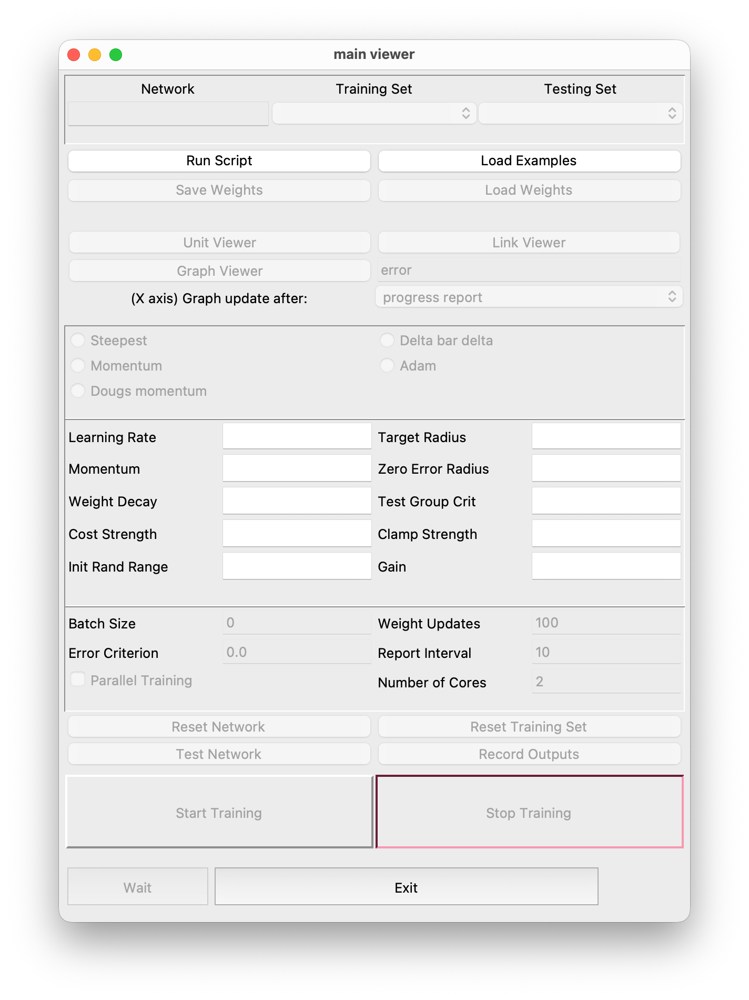

To begin exploring the GUI, load a network python script using the Run Script button.

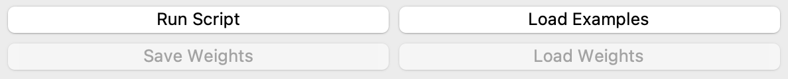

Many example network exist in the examples/example_networks/ folder of PYLens. I've chosen to load encoder_example_one.py from encoder_examples/. The GUI buttons should now be enabled. The training hyperparemeters are populated by those specified in the network's python script.

Network information
----------------------
Here you will find the name of the loaded network and its training and testing example sets.  You can see the loaded training and testing sets by clicking on the respective tab.

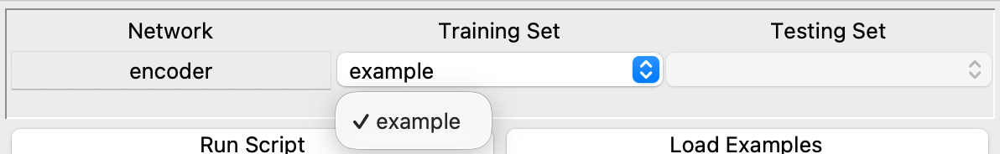

Network display
--------------------
The graphical displays are located in the network display panel. These include the unit viewer, link viewer and new graph. They provide a graphical way to probe the network's properties such as unit outputs, weights connecting different layers, and error over time.

Unit Viewer
^^^^^^^^^^^
The unit viewer is invoked by clicking the Unit Viewer button in the network display panel.

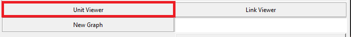

Each unit in the network's architecture correspond to a cell in the unit viewer. The units are sorted in reverse order in which layers were specified, layer by layer. You can see the value of each unit by hovering over its cell. Click on a specific Example Set on the left tab to see the values of each unit for that example.  

.. figure:: images/unit-viewer-output-0.png
   :alt: Hovering over the first unit of the output layer to see its output value on Example 4.
   :width: 600
   :align: center

To change the displayed values(i.e. from output to external inputs), click on the value tab at the top of the window and select the desired type of value to display. 

.. figure:: images/external-input.png
   :alt: Selecting and displaying external-input values in the unit viewer.
   :width: 600
   :align: center

Right clicking on a unit will display the weight of the connections coming into and out of the unit by hovering over the corresponding connected unit.

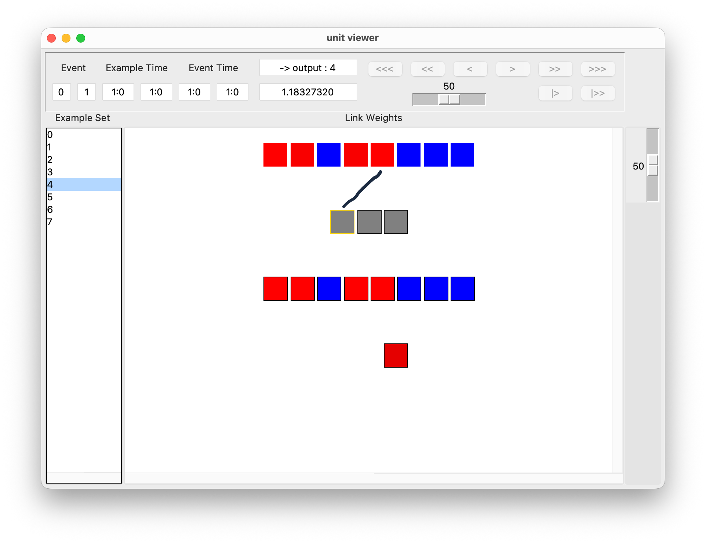

The inference set can be changed between training and testing in the Example Set tab at the top. For some networks, the inference Procedure is different during training and during testing (for example Boltzmann machines). To change the Procedure, click the Procedure tab at the top.
The Palette tab can be used to change the color palette of the unit viewer.

Link Viewer
^^^^^^^^^^^
Clicking the Link Viewer button in the network display panel will bring up the link viewer window. This window displays the weights of all the links between layers in a network. The row titles specify the layers from which the links are leaving, while the columns specify the receiving layers. Hovering over a link's cell will display it's value on the top right. In addition, the statistics of all the displayed weights are shown below the toolbar.

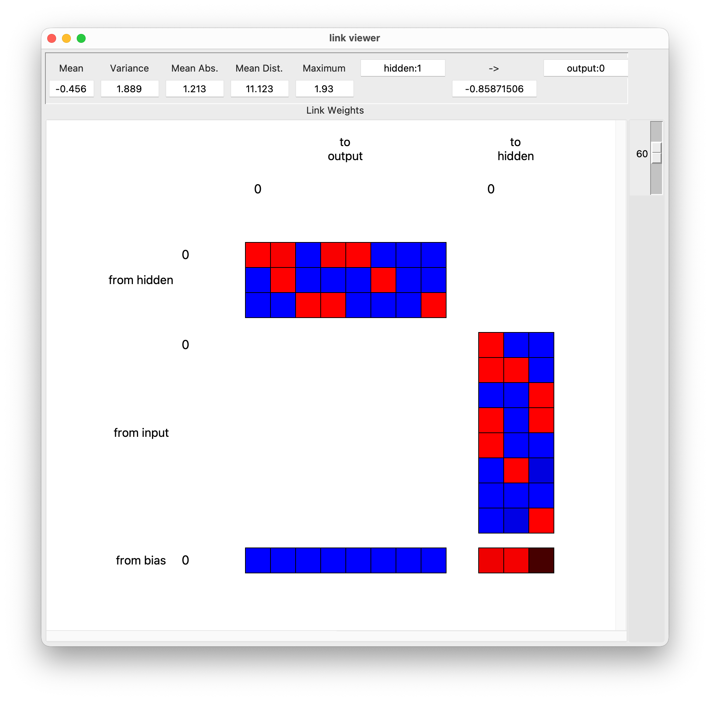

The link's values can be updated as training progresses by specifying the Update After interval within the Viewer tab.

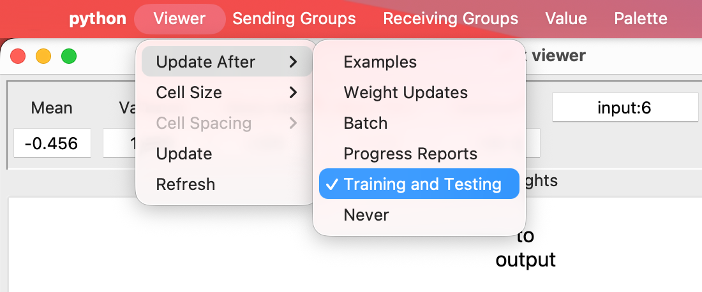

The size of each link can be modified by clicking on a size in the Cell Size dropdown menu in the Viewer tab. 

To hide or re-display specific groups in the link viewer, click on the Sending Groups or Receiving Groups tab and select the group to hide/redisplay.

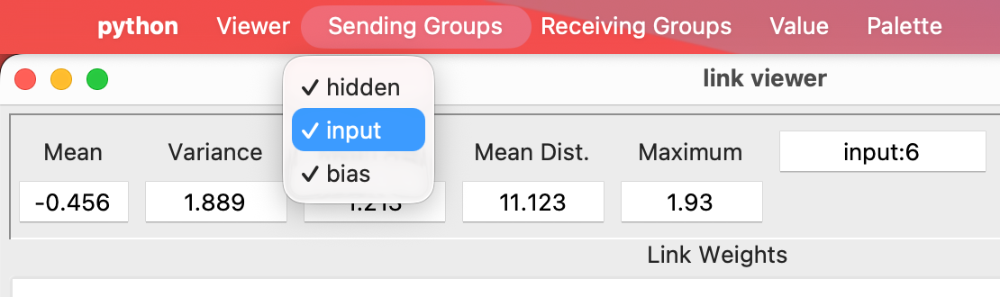

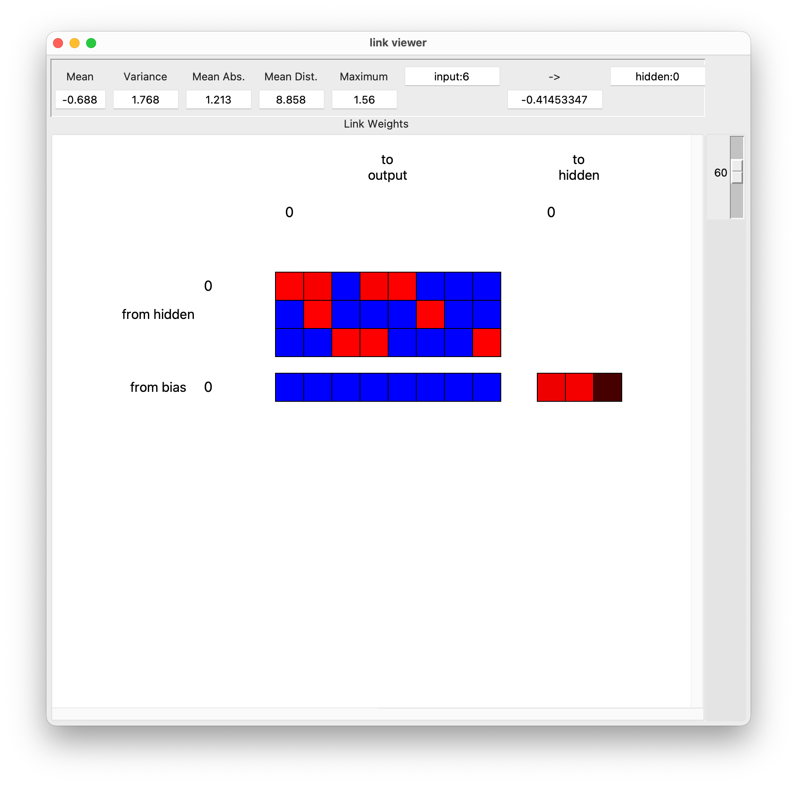

The cell's displayed value can be changed in the Value tab. The options are Link Weight, Link Derivs and Link Deltas. The Palette tab includes different color palettes to display the links with.

New Graph
^^^^^^^^^^
The New Graph button is used to invoke graphs that can plot arbitrary network properties during training. To start plotting, click the New Graph button and then click on Start Training in the main viewer. By default, the network's error will be plotted. The error will be plotted at each Report Interval for the number of training steps specified.

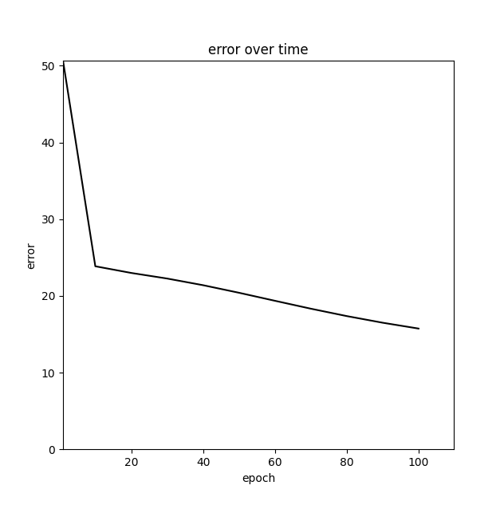

The graph's controls include the default matplotlib controls: resetting the view, panning, zooming, configuring the graph's size, and saving.

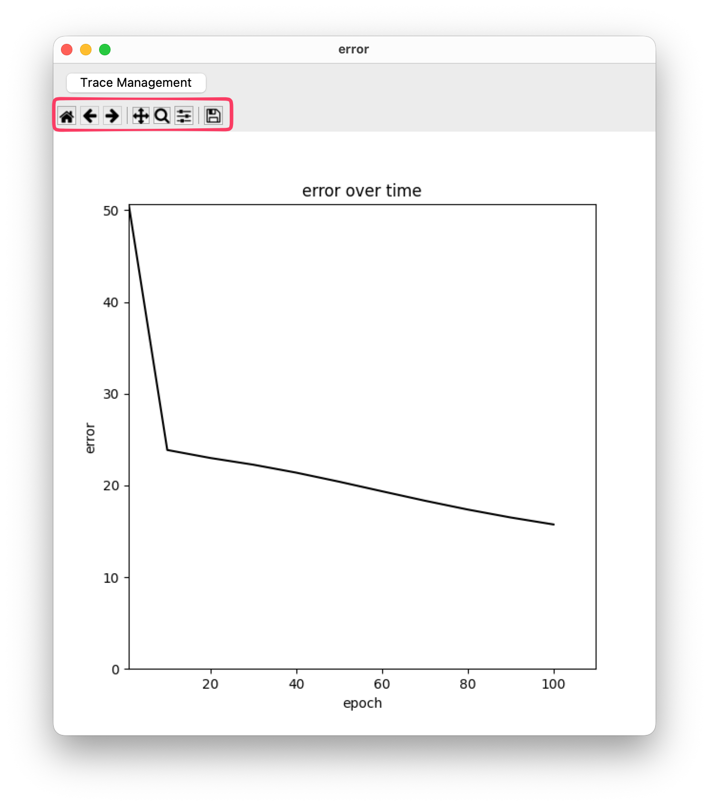

Next to the New Graph button is a text entry box where network properties can be input for plotting. Arbitrary network attributes (with numerical values) can be plotted by specifying the attribute name on the text entry box. For example, to plot the output of the first output unit in the last layer of the encoder_example_one network, I typed in ``output_groups[-1].output_matrix[1]``.

.. figure:: images/output-unit-plot.png
   :alt: Plotting the output unit. 
   :width: 600
   :align: center

Different traces are plotted each time the Reset Network button is clicked while plotting. This way, one can compare training progress between different runs. The latest trace will be plotted in black color.

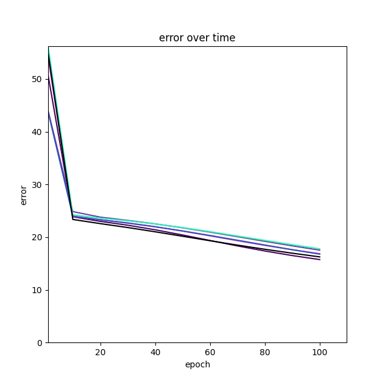

Multiple graphs can be invoked by re-clicking the New Graph button. 

File Loading
--------------
The file loading panel provides shortcuts for executing some common actions, including running scripts, loading example sets, and saving and loading weights. Each button will cause a file browser to be opened to let you choose the file for reading or writing. Depending on the command, another popup may appear once the file is chosen for setting any remaining options. 

Training algorithms
-------------------------
The algorithms panel contains radio buttons for selecting the current weight update method. The selected algorithm will be used when "Train Network" is pressed.

.. figure:: images/steepest.png
   :alt: The steepest descent algorithm is selected and will be used for training. 
   :width: 600
   :align: center

Training hyperparameters
--------------------------
The fifth panel provides access to commonly used training hyperparameters. To change a value, click in the entry box, edit the value, and then press Enter.

.. figure:: images/hyper-params.png
   :alt: Default training hyperparameters for the encoder_example_one network. 
   :width: 600
   :align: center

After loading a network, the entry boxes will be populated with the default hyperparameters specified in the network's python script.

Training options
---------------------
Entry boxes for different training options are included after the network and optimizer hyperparameters.

.. figure:: images/training-options.png
   :alt: Default training hyperparameters for the encoder_example_one network. 
   :width: 600
   :align: center

The training options are:
* Batch Size: The size of the batch seen at each training step. If 0, the batch size will include all examples in the Example Set.
* Error Criterion: The error threshold at which to stop training.
* Weight Updates: Number of weight updates that will be executed for a single press of "Start Traububg"
* Report Interval: Number of weight updates between training stats reports and graph updates.

Training control
----------------------
Training begins once a network and training examples are loaded and the Start Training button is clicked. Training can be stopped with the Stop Training button. The Reset Network button will reinitialize the networks weights and parameters so that training can begin from scratch. Test Network will run the network on the testing set, if a Example Test Set is loaded. To Exit the program, either click Exit in the training control display or click the x button at the top right corner.

.. figure:: images/training-control.png
   :alt: Training control buttons. 
   :width: 600
   :align: center